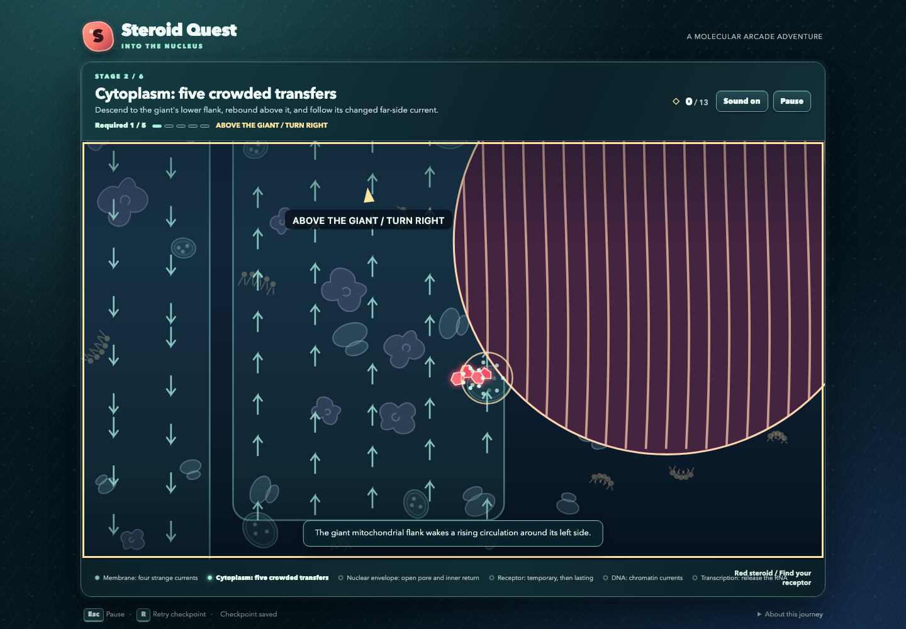
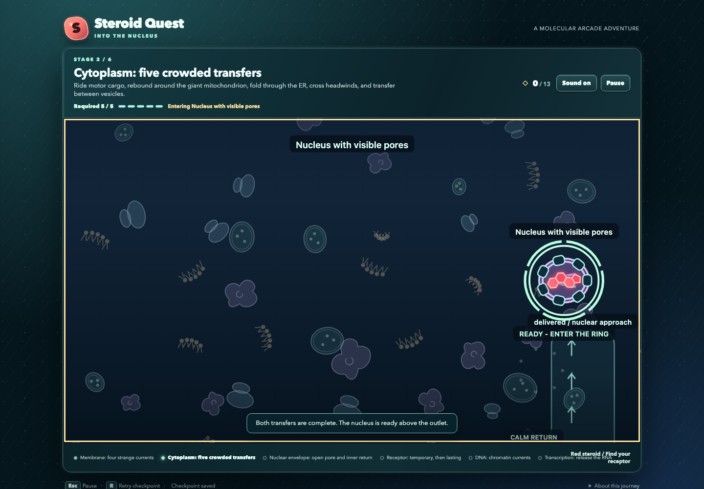

# Steroid Quest

A three-key cell adventure for biology learners. Steer a red steroid through strange currents, bouncing organelles, and vesicle rides across six illustrated regions, then bind a receptor and activate gene expression.

[Play Steroid Quest in your browser](https://vosslab.github.io/steroid-quest-into-the-nucleus/)

Choose **Start adventure** and hold Right to cross the permeable lipid bilayer. Tap Space for an
upward pulse, or hold it for gentler lift. The cell supplies currents, rebounds, and unexpected
rides. Follow the current action and complete required encounters to activate each biological
destination. Keep exploring until a growing RNA transcript announces **GENE EXPRESSION ACTIVATED**.

<!-- screenshots:begin (managed by screenshot-docs) -->


<!-- screenshots:end -->

## From steroid to RNA

| Region | Signature encounter | Recovery |
| --- | --- | --- |
| Membrane | Bilayer crest and return; backward sweep and vesicle delivery; linked loops; channel delivery | Visible downward streams and saved route changes |
| Cytoplasm | Motor delivery, giant mitochondrial rebound, folded ER channels, countercurrent relay, and crowded vesicle transfer | An optional cargo shortcut rejoins after required motor delivery |
| Nuclear envelope | Circulation, open-pore crossing, then an inner return and curved connector | Crossing saves immediately; missed approaches return |
| Receptor | Sticky gallery, matching binding, changed passage, and bound-complex transfer | Space or automatic release; binding saves and enables DNA recognition |
| DNA / HRE | Nucleosome loop, moving passage, rearranged flow, chromatin channel, and matching HRE | Permanent descents return to a broad calm docking region |
| Transcription | Three forgiving Space timing actions assemble machinery | Missed attempts repeat; polymerase then grows RNA |

The red steroid stays visible inside the receptor complex. Optional fragments reward exploration.
Ordinary contact redirects or transports the player. Marked lysosome acid is destructive;
world boundaries are safe. Retry keeps fragments, milestones, and completed route changes.
Captions and reading remain optional.

Two actual-keyboard standard routes complete in **8:45** and **9:40** of active play, within the
8-12 minute target. See the
[docs/active_plans/reports/EXPANSION_WALKTHROUGH.md](docs/active_plans/reports/EXPANSION_WALKTHROUGH.md)
and [docs/active_plans/reports/EXPANSION_INDEPENDENT.md](docs/active_plans/reports/EXPANSION_INDEPENDENT.md).
All 12 required recovery cases and the final visual assessment pass; see
[docs/active_plans/reports/EXPANSION_ACCEPTANCE.md](docs/active_plans/reports/EXPANSION_ACCEPTANCE.md)
for the evidence and final review status. The earlier two-minute walkthrough describes the previous
campaign. Required encounters provide the added activity, with no minimum-duration timer.

## Quick start

Use Node.js, npm, Python 3, and a browser with a keyboard. From the repository root:

```sh
npm install
./run_web_server.sh
```

The script builds and serves `dist/`. Open its local address and choose **Start adventure**.
Stop the server with Ctrl+C. Set `PORT` to choose a port.

## Controls and retries

| Action | Keys |
| --- | --- |
| Apply horizontal force; brake and reverse | Left / Right |
| Strong upward pulse | Press Space |
| Gentle continuous upward thrust | Hold Space |
| Optional fine control up / down | Hold Up / Down |
| Coast through the fluid | Release all keys |
| Pause / resume | Esc, or menu buttons |
| Retry checkpoint | R, or menu button |
| Navigate menus | Tab and Enter |

Left, Right, and Space remain the primary controls. Optional Up/Down provides gentle free-motion
adjustment; it cannot release attachments or perform transcription actions. Required routes must
also work with the three primary keys. There is no global gravity: visible descending and returning
currents provide recovery.
Sound defaults to on and begins with Start. The title, play, and pause screens offer a sound toggle.
The game pauses and silences sound when it loses focus. Retry and Replay retain the session's
sound choice. Replay starts a fresh campaign; progress is never stored across page sessions.

Completing each required encounter saves a calm checkpoint. A destination shows incomplete
progress until its encounters are complete; early contact redirects you toward the current action.
An active destination captures the steroid for a one-second zoom into the next region. Pause
freezes that transition, Retry returns to the saved checkpoint, and reduced motion uses a crossfade.
Escaping a required ride leaves delivery pending; follow the reboarding cue and stay aboard until
the ride delivers you.

## About the biology

This is a generic nuclear steroid-receptor example. Receptor locations vary. The open pore is
this level's route; steroids do not universally require pores for nuclear entry. Forces,
transport rides, sticky contacts, and organelle rebounds are exaggerated arcade interpretations.
The complex remains at the hormone response element (HRE) while machinery assembles near the
promoter and transcription begins. Binding artwork preserves the red steroid's four-ring scaffold;
its exaggerated shape adjustment represents accommodation, not a chemical conversion.

## Build and verify

```sh
./check_codebase.sh
./build_github_pages.sh
./run_playwright_tests.sh --build
source source_me.sh && python3 -m pytest tests/
```

The game uses TypeScript, SolidJS, Canvas 2D, procedural illustrations, and synthesized sound.
The build produces the GitHub Pages-ready `dist/` artifact. Remote publication is separate;
the live link can still show an earlier release until publication.

- [docs/SOLID_MODEL.md](docs/SOLID_MODEL.md): simulation authority, lifecycle, and biological limits.
- [docs/LEVEL_DESIGN.md](docs/LEVEL_DESIGN.md): chamber authoring, forces, and recovery.
- [docs/PLAYWRIGHT_USAGE.md](docs/PLAYWRIGHT_USAGE.md): browser setup and capture usage.
- [docs/active_plans/reports/fluid_walkthrough.md](docs/active_plans/reports/fluid_walkthrough.md):
  historical actual-controls walkthrough of the earlier campaign, captures, and measured limits.
- [tests/TESTS_TYPESCRIPT_README.md](tests/TESTS_TYPESCRIPT_README.md): verification tools.
- [docs/CHANGELOG.md](docs/CHANGELOG.md): implementation and validation history.

## License

Source code uses the MIT license: [LICENSE.MIT](LICENSE.MIT).
